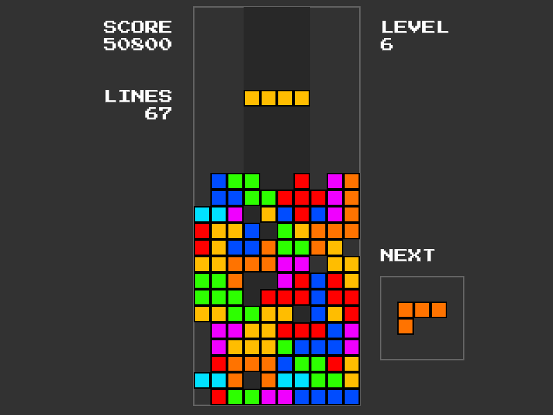

# Tetris

Tetris is a loose remake of original Tetris game, it has been created as a university project at a University of Silesia (Uniwersytet Śląski).

This project was created in cooperation with [Piotr Kłosek](https://github.com/Peterka15).

# Play online!
You can play Tetris online, just [click here](https://dabalroman.github.io/tetris/).

| Action | Button |
| --- | --- |
| Move left | `⬅` |
| Move right | `➡` |
| Rotate clockwise | `⬆` or `X` |
| Rotate counter-clockwise | `Ctrl` or `Z` |
| Soft-drop | `⬇` |
| Hard-drop | `Space` |

Project is available to play online thanks to GitHub Pages.

# About Tetris
## Technical stuff
Project uses p5.js as a rendering library. It was written purely in JavaScript.
It's based on react webpack config, so it can be developed, served and built without any hustle.

## Licensing
All sounds used in Tetris comes from freesound.org and are published on free-to-use licences.
The "Press Start 2P" was created by Cody "CodeMan38" Boisclair, 
it's distributed by fonts.google.com and is published under Open Font License.
All other assets were created in-house.
